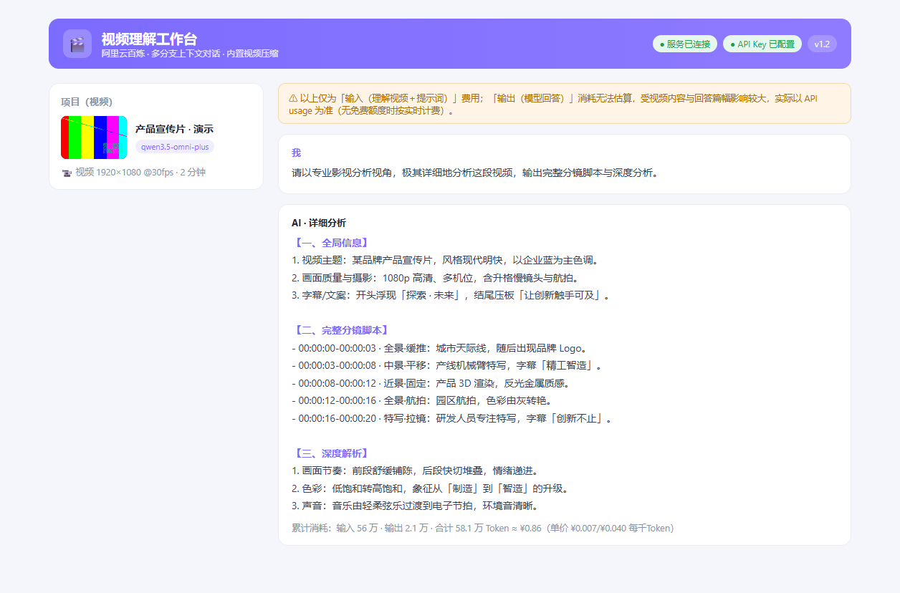
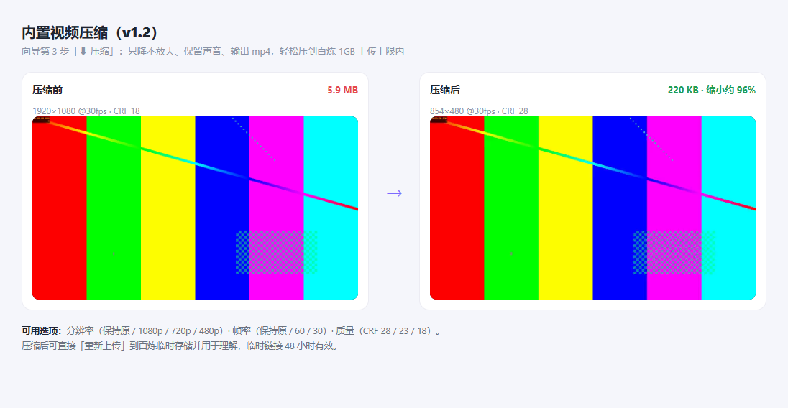

# 🎬 视频理解工作台（阿里云百炼）`v1.3`

一个开箱即用的**视频理解 + 多分支上下文对话**前端工具：

- 选择本地视频 → **直接上传**到阿里云百炼临时存储（48h 有效）→ 以原生 `video_url` 交给大模型理解（官方抽帧管道，效果最佳；支持视频里的**声音/音效**理解）
- 每个视频理解完成后成为一个**项目**，项目下可创建**多个分支对话**，围绕同一视频进行不同方向的追问，上下文连续
- **内置视频压缩（v1.3）**：无需额外安装，直接把大视频压到 1080p/720p/480p、60/30fps（只降不放大、保留声音、输出 mp4），轻松压到百炼 1GB 上传上限内（见下方「界面预览」）
- **实时进度与速度**：上传 / 转存 / 压缩全程实时显示**百分比、已传字节/总量、上传速度与剩余时间**；压缩时还会显示**已处理 / 总时长**，过程一目了然
- 科学 Token 预估：按百炼官方「计算图像与视频 Token」规则实现（抽帧 fps、smart_resize 缩放、总像素预算），发送前即可看到预估消耗与费用
- 对话记录自动保存（浏览器 IndexedDB），可导出/导入 JSON 备份
- 界面支持流式输出、思考过程折叠显示、按模型内置官方单价估算费用

> 依据官方文档（2026-08）：[图像与视频理解](https://help.aliyun.com/zh/model-studio/vision) · [全模态 Omni](https://help.aliyun.com/zh/model-studio/omni) · [模型调用计费](https://help.aliyun.com/zh/model-studio/model-pricing)

## 🖼 界面预览

**视频理解结果**（理解完成后自动进入项目，可围绕同一视频多分支追问）：



**内置视频压缩（v1.3）**——把超过百炼 1GB 上传上限的大视频压小，再上传理解：



> 💡 **关于费用**：程序里展示的是「输入（理解视频＋提示词）」费用；「输出（模型回答）」消耗无法估算、受视频内容与回答篇幅影响大，实际总费用以每次 API 返回的 usage 为准（无免费额度时按实时计费）。长视频 + 详细提示词（如默认分镜脚本）+ 旗舰模型时单轮可能明显更高，建议降低抽帧 fps / 精简提示词 / 换更便宜模型。

---

## 一、快速开始（3 步）

1. **双击 `启动.cmd`**（开发版需本机安装 Python 3.8+，**共享版已内置 Python，无需任何安装**；均无第三方依赖），浏览器自动打开 `http://127.0.0.1:8686/`
2. 右上角 **⚙ 设置** → 填入阿里云百炼 API Key（保存到项目文件夹 `config.json`，仅本机使用）→ **测试连接** → **保存**（重点提示：改完设置一定要点右下角「**保存**」按钮才会写入；只点右上角 ✕ 或"测试连接"不会保存单价）
   - 设置中可填写**单价参考**（¥/千Token，留空则使用应用内置的官方单价表）；**模型管理**里可以**从百炼拉取模型列表**扩充下拉选项，也可用 **🗑 移除** 删除不想要的自定义模型
   - 若使用业务空间专属域名，设置中把接口地址改为 `https://{WorkspaceId}.cn-beijing.maas.aliyuncs.com` 即可
3. 点击 **＋ 新建项目**：
   - `1 选择视频`：拖拽/选择本地文件（推荐，自动上传），或粘贴公网视频 URL（跳过上传，百炼直接解析）
   - `2 模型与参数`：选择理解模型、抽帧频率 fps（0.1~10，默认 2）、自定义理解提示词
   - `3 预估与理解`：查看 Token 预估、费用、模型限制校验（时长/大小/帧数），点击 🚀 **开始理解**

理解完成后自动进入项目，左侧列表可 **＋ 分支对话** 任意新建——**新分支对话会自动继承「视频理解」阶段的完整分析作为起点上下文**（打开即可看到，追问时模型天然知道视频内容，不额外计费）；聊天区右上角切换模型、开启「**每轮附带视频**」（每轮重新计算视频 Token，效果更保真；关闭则基于理解结果与历史文本对话，更省）。

> **纯文本模型**：理解完成后，模型下拉选中可选**纯文本模型**（标注"（文本）"，如 `qwen3.7-plus`、`qwen3.5-flash`、`qwen-max` 等）——只要不勾选「每轮附带视频」，纯文本对话完全可用且更便宜；勾选「每轮附带视频」时界面会自动阻止（纯文本模型看不懂视频）。新建项目的「理解」步骤只显示视觉/全模态模型。
>
> 小技巧：生成中可点 **■ 停止** 中断（已生成内容会保留为一条消息）；对话很长时可点聊天区右下角 **↓** 快速回到底部；项目卡片支持 **✎ 重命名**、**⬆ 重新上传**（见「临时链接过期」一节的说明）。

---

## 二、支持模型与官方单价（华北2·北京，每百万 Token）

| 模型 ID | 输入价（图/视频） | 输出价 | 视频时长限制 | 说明 |
|---|---|---|---|---|
| `qwen3-omni-flash` | 3.3 元 | 6.9 元 | ≤150 秒 | 全模态轻量·**主推**·可听音频·单次输入限 150 秒 |
| `qwen3.5-omni-flash` | 2.2 元 | 13.3 元 | 与全模态规则一致 | 全模态轻量 |
| `qwen3.5-omni-plus` | 7 元 | 40 元 | ≤1 小时 | 全模态旗舰·音频输出·联网搜索·长视频 |
| `qwen3-vl-plus` | 1~3 元（阶梯） | 10 元 | ≤1 小时 | 纯视觉·思考可开关 |
| `qwen3-vl-flash` | 0.15 元 | 1.5 元 | ≤1 小时 | 纯视觉·最便宜 |
| `qwen-vl-max` | 1.6 元 | 4 元 | ≤20 分钟 | 传统视觉主力 |
| `qwen-vl-plus` | 0.8 元 | 2 元 | ≤10 分钟 | 传统视觉 |

- **免费额度因账号而异**：部分新开通账号有 100 万 Token 免费额度（自开通百炼/模型发布之日起 90 天内），但**并非所有账号都有**（业务空间/已开通账号可能无免费额度）。请以百炼控制台为准，**不要依赖免费额度**，大额使用前先评估费用。
- 实测参考：7.4 秒 720p 短视频 + 一轮追问 ≈ 8,800 Token ≈ **¥0.03**
- 未收录的模型按通用规则估算，界面会提示；实际消耗以每次 API 返回的 `usage` 为准（界面底部累计展示）
- 费用受到多方面因素影响，程序体现仅为预估费用，开发者不对准确性负责。

**选型速查（界面内置完整指导）**：短视频（≤150 秒）优先 **Omni 全模态**（能听声音·最划算）；**纯视觉 VL 系列**适合无需声音的较长视频（≤1 小时更省）；理解完成后可切 **纯文本模型**（如 qwen3.7-plus）省钱追问。新建项目第 1 步有选型提示、第 2 步展示每个模型的适用场景/限制/单价；对话区模型下拉旁 **ⓘ** 可随时查看当前模型说明。

---

## 三、注意事项

- **临时链接 48 小时有效**：上传的视频在 48h 后失效，届时「每轮附带视频」不可用。恢复方法：在项目卡片点 **⬆ 重新上传** 选择同一视频文件（无需新建项目），新链接 48 小时有效且项目内所有对话的历史视频引用会自动更新；过期后 **🔄 重新理解** 按钮会引导你先重新上传再理解（左侧项目列表对过期项目有 ⚠ 徽章，卡片显示有效期倒计时）
- **免费额度**：因账号而异（部分有 100 万、部分无），以百炼控制台为准，**不要依赖**；产生费用前先在预估页看费用
- **密钥安全**：API Key 仅存于项目文件夹 `config.json`（明文，本机使用）。不要在文本框外复制传播；测试完成后可删除该文件。
- **多轮费用**：开启「每轮附带视频」后每轮都会重新计视频 Token（如 20 分钟视频单轮约 5 万 Token），长视频建议仅在需要核对画面时开启
- **本地服务**：仅监听 `127.0.0.1:8686`，所有业务数据（项目/对话/消息）保存在浏览器 IndexedDB，服务端不落库
- **思考模型**：`qwen3-omni-flash` 等混合思考模型开启思考时，界面会先显示可折叠的思考过程

## 四、打包到其他电脑

**v1.3 共享版**：项目根目录下已生成共享包文件夹 `视频理解工作台-v1.3/`（及同名 `.zip`）——里面是干净的可分发版本：配置文件已清空，不含本机 API Key、业务空间域名、测试视频或缓存文件，并**内置了便携版 Python 3.14.7（`python/` 文件夹）与 `ffmpeg.exe`（`ffmpeg/` 文件夹，用于内置视频压缩）**——目标电脑**无需安装 Python/ffmpeg**，双击 `启动.cmd` 即可运行。

整个文件夹（`index.html` + `assets/` + `server.py` + `启动.cmd` + `config.json` + `python/` + `ffmpeg/`）压缩即用：

- **共享版无需安装 Python**（已内置），`启动.cmd` 会优先使用 `python\python.exe`；若该文件夹被误删，则回退到系统 Python 3.8+（勾选 Add to PATH；**3.6 及更低版本、以及微软商店的"存根"（未安装商店版 Python 时）不可用**——启动器会自动跳过并给出中文提示）
- 无需 pip、无第三方依赖（Python 标准库实现）
- **双击报错/提示退出怎么办**：启动器已自带诊断——缺文件会提示"项目文件不完整"（说明漏拷了文件，请整包复制）；找不到/版本过旧的 Python 会提示安装步骤；安装好 Python 后重新双击即可。也可在 cmd 里手动运行：`cd /d "项目目录"` 后 `py -3 server.py` 看完整报错
- 首次运行：双击 `启动.cmd` → 在 ⚙ 设置中填入**目标账号的 API Key**（百炼的 Key 与账号绑定，换账号需重新填）→ 点右下角「**保存**」
- ⚠ **共享版已清空 config.json**：包里不含本机 API Key；收到包后在设置页自行填写自己的 Key 即可。不要把 Key 发给别人
- 换电脑后浏览器数据（项目/对话）不会自动迁移；可在 ⚙ 设置 → 导出全部数据，在新电脑导入

## 五、文件结构

```
视频理解工作台/                      # 开发目录（v1.3）
├── 启动.cmd               # 双击启动（python server.py）
├── server.py              # 本地服务：静态托管 + 上传/对话代理（纯标准库）
├── index.html             # 界面
├── assets/
│   ├── style.css          # 样式
│   └── app.js             # 前端逻辑：状态/持久化/流式对话/Token 估算
├── scripts/
│   └── 端到端验证.mjs      # 自检脚本（可选）：node scripts/端到端验证.mjs [模型]
├── config.json            # 本机配置（API Key / Base URL / 单价）
```

> **v1.3 共享版**（`视频理解工作台-v1.3/`，即根目录旁的共享包）：结构同上，但 **config.json 已清空**（初始 `apiKey` 为空、`baseUrl` 为默认公网端点），不含 `测试.mp4`、`__pycache__` 等开发/缓存文件，可直接发给他人。首次使用在 ⚙ 设置中填入对方自己的 API Key。

## 六、常见问题

| 问题 | 解决 |
|---|---|
| 双击「启动.cmd」窗口一闪而过 | 旧版启动器含中文，在中文系统 GBK 控制台下会解析错乱导致闪退（已修复为纯 ASCII 版）。请使用本文件夹内最新版 `启动.cmd`；若仍异常，右键「以管理员身份运行」看报错文本反馈 |
| 双击后提示「程序退出」/报错 | ① 目标电脑未装 Python 3.8+（或只有 2.x/3.6/商店存根）：按窗口提示安装 Python（勾选 Add python.exe to PATH）后重试；② 提示「项目文件不完整」：漏拷了文件，请整包复制 `index.html + assets/ + server.py + 启动.cmd`；③ 其余报错请在 cmd 里执行 `cd /d "项目目录"` 然后 `py -3 server.py` 看完整错误并反馈 |
| 页面提示「未检测到本地服务」 | 双击 `启动.cmd` 后再刷新；确认 8686 端口未被占用（脚本会自动换端口并打印地址） |
| 上传失败 | 检查 API Key 是否有效、所选模型是否对文件绑定（上传时使用当前选择的模型，不可混用）；文件是否超过模型大小上限。**注意**：百炼临时存储单文件 **≤1GB**（`getPolicy` 的 `max_file_size_mb` 通常为 1024），超限 OSS 会返回 `400 Bad Request`——v1.3 起会在发送前拦截并给出「超过该模型允许的上传大小上限」的清晰提示；也可用向导第 3 步的「**⬇ 压缩**」按钮把 1080p/60fps 压到可选分辨率/帧率（只降不放大、保留声音、输出 mp4），压到 1GB 内即可上传；或改用公网视频 URL（跳过上传） |
| 上传成功但理解报错 | 临时链接过期（先点 **⬆ 重新上传**，再点 **🔄 重新理解**）；或模型不支持该时长/格式（界面预估页会提前警告） |
| 误点了发送/生成太久 | 点 **■ 停止** 立即中断，已生成内容会保留 |
| 想用别的模型 | ⚙ 设置 → 从百炼拉取模型列表 → 下拉框即出现全部可用模型；或在聊天区直接选择 |
| 费用不准 | 单价取自 2026-08 官方文档，价格变动以百炼控制台为准；可在设置中覆盖单价 |
